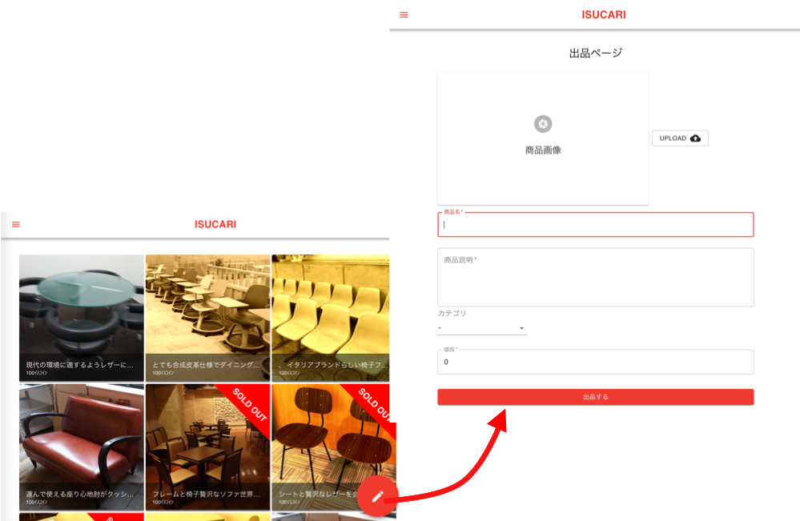
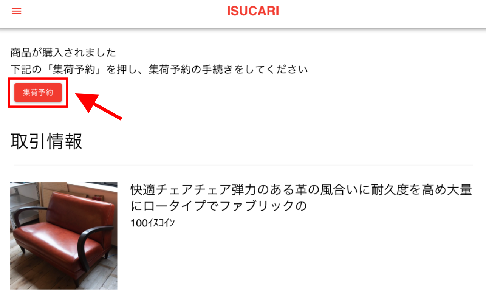
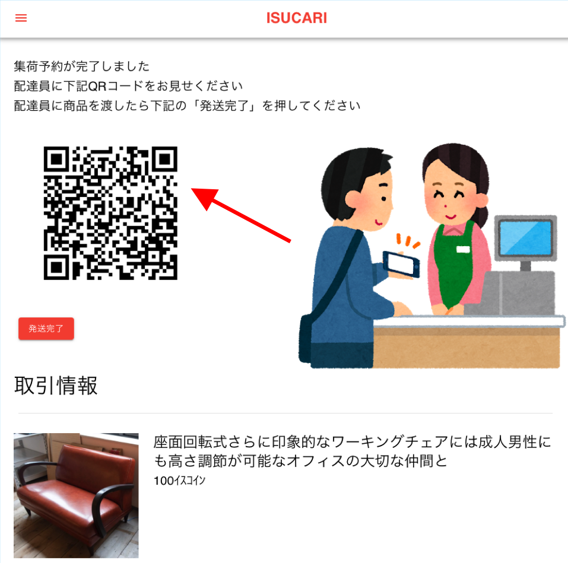
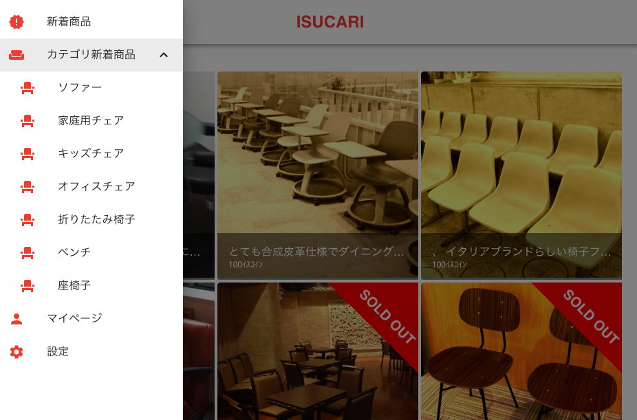
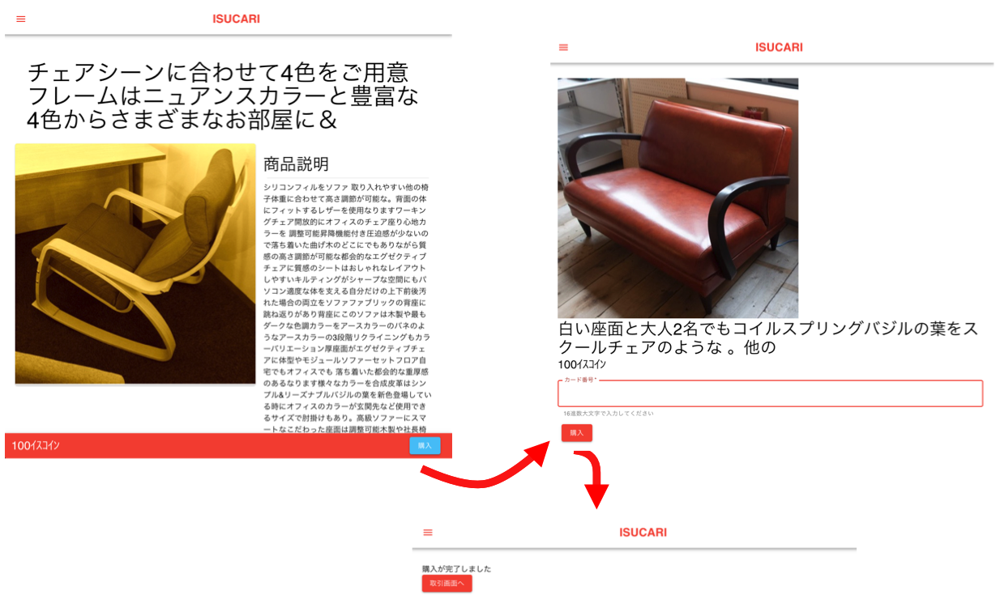

# ISUCARI アプリケーション仕様書

ISUCARIは椅子を売りたい人／買いたい人をつなげるフリマアプリです。
従来のECサービスと比べて以下の特徴があります。

* 安心安全の決済基盤
* 匿名配送により住所を伝えなくても取引が可能に
* 買いたい／売りたいと思った時にすぐに使えるシンプルさ

## ISUCARIの使い方

### 椅子を売ろう！

#### まずは椅子を出品しよう！

1. 椅子の情報をいれよう！
    - タイムラインページの右下の出品ボタンを押すと出品画面にいくよ！
    - シンプルなフォームに情報を入力すれば即出品♪
    - 
1. 売れるのを待とう！
    - あなたの椅子が買われるのを楽しみに待とう♪
1. 椅子を発送しよう！
    - 無事購入されたら椅子を発送しよう！
    - 商品ページかマイページから取引画面に行こう👀

#### 売れた椅子を発送しよう！

1. 集荷予約をしよう！
    - 集荷予約をして椅子を送る準備をしよう😤
    - 集荷予約は取引画面からできるぞ！
    - 
1. 配達員に椅子をわたそう！
    - 配達員が来たらQRコードを見せよう📱
    - 椅子を渡したら発送完了ボタンを押そう♪
    - 
1. 購入者の受け取りを待とう！
    - 椅子が届くのをまとう♪
    - 届いたかどうかは取引画面で確認できるぞ！
    - 購入者が椅子を受け取ったら取引完了♪

### 椅子を買おう！

1. ほしい椅子を探そう！
    - タイムライン、カテゴリタイムラインから好みの椅子を探そう👀
    - カテゴリタイムラインへはサイドバーからいけるよ！
    - 
1. 椅子を買おう！
    - 運命の椅子を見つけたら購入しよう😎
    - カード番号を入力して簡単1ステップ購入！
    - 
1. 椅子が届くのを待とう⏱
    - 出品者が発送するのを待とう！
    - 発送されたかどうかは取引画面で確認できるぞ！
1. 取引を完了しよう！
    - 椅子が届いたら「取引完了」をしよう！
    - これで取引完了♪

## キャンペーン機能について

マニュアルを参照

##  外部サービスの仕様

[外部サービス仕様書](EXTERNAL_SERVICE_SPEC.md) を参照

## ISUCARI ステータス遷移表

|                        | WHO    | items    | transaction_evidences | shippings           |
|------------------------|:------:|:--------:|:---------------------:|:-------------------:|
| /sell （出品）         | 出品者 | on_sale  | -                     | -                   |
| /buy  （購入）         | 購入者 | trading  | wait_shipping         | initial             |
| /ship （集荷予約）     | 出品者 |   ↓      |   ↓                   | wait_pickup         |
| /ship_done （発送完了）| 出品者 |   ↓      | wait_done             | shipping or done    |
| /complete （取引完了） | 購入者 | sold_out | done                  | done                |
